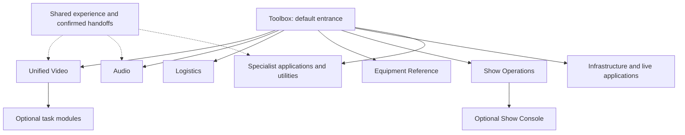

# AV Suite consolidation: Toolbox and focused applications

**Implementation update 2026-10-03:** [AV Video](../av-video/) combines Signal Flow and Video Patch as one standalone application launched from Toolbox, with optional modules and its own versioned document. See [the implemented workflow](av-video.md). Cross-application document linking remains deferred; it is not a prerequisite for this independently saved route-and-patch slice. The October 3 Displays & Projection slice adds destination records, explicit route links and lossless imports from Display Plan and Projection Plan. Cameras, Playback, Stream Plan and Record Log remain planned. Full capability and operator acceptance, and legacy entry retirement, remain open.

**Decision revision:** 2026-10-02, requested by Dave. The October 2 clarification removes assumed Workbook adoption, recovery and migration requirements from public withdrawal. This is the maintained product and migration plan. It supersedes the September 23 seven-workspace proposal and the September 29 recommendation to build Video inside Workbook. The [dated specification](av-suite-consolidation-spec-2026-09-23.md) remains historical evidence.

**Delivery boundary, updated 2026-10-04:** The neutral Toolbox rule and pre-merge viewport/theme gates merged in PR #256. The Workbook withdrawal candidate removes public discovery, editor/source publication and offline dependencies; all former URLs use noindex redirects to Toolbox without accessing saved data. The 56-case domain browser suite passes, including storage preservation on both origins, and all 60 retained Workbook source tests pass. Candidate publication and live readback remain required before Stage 1 is called delivered. Stages 2–6 and Video increments 2.0a–2.5 remain the maintained authority; neither the application map nor operator acceptance is implied by this foundation work. See the [doorway contract](av-suite-doorway.md).

## Settled product decisions

1. **Toolbox is the default entry point.** A person can find and open an application without creating a show, selecting a venue, or opening Workbook. Show Console remains an explicit, optional entrance for show operations.
2. **Organize the suite as focused applications with a shared experience.** Adobe Suite is the product reference: recognizable applications for different jobs, with common conventions and useful handoffs. It is not a requirement to copy Adobe branding, licensing, cloud services, or its exact interface. Consolidation joins related workflows where that completes a job; it does not turn every application into a tab in one mandatory container.
3. **Users can turn optional modules off.** This reduces navigation, panels, commands, and routine prompts for work they do not do. Preferences must be reversible and must not delete saved work or conceal active operations.
4. **Video remains directly visible.** Unified Video covers cameras, playback, switching and signal flow, displays and projection, streaming, and recording. It launches as a focused application from Toolbox and works without Workbook. Its implementation does not inherit Workbook as its host or required data store.
5. **Remove AV Workbook from the public website.** The public product and discovery surfaces must stop promoting or launching Workbook. Retain its concept, source history, and migration knowledge for a possible future redesign. A future return needs a new product brief; it is not a dependency of this consolidation program. Per Dave on October 2, do not factor assumed Workbook users or recovery needs into withdrawal: no recovery notice, dedicated export flow, transition period or migration project is required.
6. **Carry these decisions forward.** Do not ask again whether Toolbox is the default, whether modules can be disabled, whether Video should be visible, or whether Workbook is required or should be withdrawn. Surface only consequential unresolved choices before the affected implementation; choose routine engineering details autonomously within these boundaries.

## Application model

Toolbox owns discovery, launch, and personal visibility preferences. An application owns a coherent job, its documents, validation, and exports. A module is an optional capability inside that application. Shared experience means consistent navigation, theme, terminology, keyboard and recovery behavior, plus explicit compatible handoffs; it does not mean a shared writable document or mandatory show setup.

The following map organizes current capabilities. Labels other than established product names are working application names, not a direction to rename existing public products. The exact split of Infrastructure and Live Control is a consequential choice below. Existing specialist applications stay independently launchable.

| Application or application family | Job and proposed modules | Inputs and outputs | Ownership boundary |
| --- | --- | --- | --- |
| **Unified Video** (visible launch label includes **Video**) | Follow a source through Switching & Routes; optionally Cameras, Playback, Displays & Projection, Stream & Record, and their issue views | Sources, destinations, routes and legacy imports → tested planning records, issues, exports and specialist handoffs | Own Video documents; no Workbook dependency. A diagram never proves a physical path is verified. |
| **Audio** | Inputs → Patch → Line Check; optional Speakers and RF & Comms | Source/channel identity and checks → patch, check and handoff outputs | Keep original fields, RF semantics and operator attribution; do not squeeze frequency or comms work into a channel row. |
| **Logistics** | Prep → Pack → Load In → Strike; optional Cable | Item/case identity and locations → pack/load/strike records and exceptions | Keep missing, blocked and unaccounted gear visible; reading a reference sheet never changes prep status. |
| **Equipment Reference** | Device search, sheets, components, evidence and procedures | Equipment question → cited product information and useful offline text | Equipment-only public content, independent of shows and venues. Venue models require an explicit source-owned workspace binding. |
| **Show Operations** | Advance, Rooms, Crew, Tasks and Closeout; optional Show Console | Explicitly attached show, room and people records → operating views and handoffs | Workbook is not its shell or prerequisite. Preserve Show Board timeline/snapshot recovery and explicit client-output confirmation. |
| **Infrastructure family** | Power, Network and Lighting | Distribution, capacity/address and fixture inputs → plans, checks and exports | Keep specialist semantics. Whether these become one focused app or separate applications remains open. |
| **Live Control family** | Cue Sheet, Show Timer and Teleprompter | Rundown, clock and script → dedicated operating/display outputs | Retain the existing focused applications and reliable full-screen controls. A combined live runtime is not assumed. |
| **Specialists and utilities** | Throwline, PixelForge, StagePlotter, AV Calculator and LED Wall Calculator | Each application's supported planning/editor inputs → its existing document or output | Direct Toolbox launch plus contextual links. Shared launch does not merge their data. OnTrack retains its separate music-product boundary. |

### Capability disposition

This is the planning disposition of the **45 registered tools at the revision baseline**, not a replacement runtime registry. Generate current counts from [`js/sbd-registry.js`](../js/sbd-registry.js) and the [inventory](av-suite-consolidation-inventory.md). A navigation home never authorizes deletion of a route or saved data.

| Planning home | Registry IDs | Count |
| --- | --- | ---: |
| Show Operations | `show-advance`, `site-survey`, `crew-call`, `crew-time-log`, `room-check`, `breakout-room-matrix`, `show-board`, `show-task-board`, `show-handoff`, `show-report`, `change-order`, `client-signoff` | 12 |
| Unified Video | `signal-flow`, `video-patch`, `display-plan`, `projection-plan`, `stream-plan`, `record-log`, `camera-shot-list`, `playback-check` | 8 |
| Audio | `input-list`, `audio-patch`, `line-check`, `speaker-plan`, `rf-coordination`, `comms-check` | 6 |
| Logistics | `gear-prep`, `truck-pack`, `load-in-plan`, `strike-plan`, `cable-plan` | 5 |
| Equipment Reference | `gear-reference` | 1 |
| Infrastructure family | `power-plan`, `network-plan`, `lighting-patch` | 3 |
| Live Control family | `teleprompter`, `show-timer`, `cue-sheet` | 3 |
| Independent specialists and external music product | `pixelforge`, `throwline`, `stageplotter`, `av-calculator`, `led-wall-calculator`, `ontrack` | 6 |
| Withdraw from public product; retain for possible redesign | `av-workbook` | 1 |
| **Baseline total** | | **45** |

LED Wall Calculator remains a directly launchable specialist, also reachable from Video's Displays & Projection. It is not automatically converted into a Video record type. The historical [Tool Index v2](../av-tool-suite/index-v2/index.html) is not a second operating suite.

## Toolbox and shared experience

- A fresh or neutral visit to `av-suite.html` opens Toolbox without a mandatory doorway question. The AV home page's primary application action opens Toolbox. Explicit `?entry=show`, `?entry=toolbox`, and supported legacy show-context links retain their documented targets. An old saved Show Console preference must not silently defeat the new neutral default; preserve unrelated pins, recents and show data during preference migration.
- Applications have a clear name, current task, direct URL and dependable return to Toolbox. Back/Forward restore the application/task. Show Console and optional show attachment remain available without becoming a launch gate.
- Toolbox distinguishes substantial applications, quick utilities and legacy tools awaiting consolidation. A thin wrapper around old pages is not a completed application. Search finds tasks as well as names and opens the owning application/module.
- Keep navigation, light/dark theme controls, focus, save feedback, import preview, export and recovery conventions consistent. Light is the first-use default. Specialist controls remain suited to their own work.
- Desktop/laptop uses top or side task navigation; mobile uses a labeled bottom rail unless a documented product/accessibility need warrants a different arrangement. Video must be visible on the default Toolbox view without opening a generic Systems group or search.
- Use a viewport-locked `100dvh` shell with no page-level vertical or horizontal scrolling. Distinct subjects use tabs or pages; inherently long tables, lists and logs scroll inside bounded panels. Use ultrawide space for useful context rather than a stretched narrow column.

## Optional modules

The capability is settled. The shipped AV Video modules (Patch, Displays, Checks and Backups) travel with its saved document and are enabled initially. Future application presets and broader user/device preferences remain choices for the affected implementation.

1. **Control:** Provide a plainly labeled Manage modules control in Toolbox and each affected app. Show what each module does and allow enable, disable, and restore defaults. Toolbox may also hide unneeded applications from the user's personal launch view; Manage applications keeps them recoverable.
2. **Reduced clutter:** A disabled module disappears from normal tabs, cards, contextual panels, commands and default search results. An explicit Show disabled option in management/search makes it findable again. Do not leave empty tabs or repeated upgrade-style prompts.
3. **Data preservation:** Disabling changes visibility, not document contents, import coverage or data ownership. Full-document backup/export retains disabled-module data; a deliberately scoped report identifies exclusions. Re-enabling restores existing work. Module preference changes never write `av-suite-dashboard.v1` readiness or mutate legacy records.
4. **Dependencies:** Declare core functionality and module dependencies. Explain a required dependency before enabling it. Do not silently re-enable modules, suppress unresolved cross-module faults, or show an all-ready result for unevaluated work. Readiness identifies its evaluated scope.
5. **Deep links and recovery:** A link to a disabled module shows its name and an explicit enable/open action. It does not silently change preferences or discard the route. Cancel returns to the app or Toolbox. Unknown/removed module IDs have a useful fallback.
6. **Active operations:** A visibility toggle must never stop, hide, or orphan a running cue, timer, recording/control session or unsaved edit. Keep that active surface reachable and defer the toggle until the operation is safely resolved by the user.
7. **Persistence:** Preserve the shipped AV Video contract: module visibility belongs to its versioned document and travels in a full backup. Toolbox application visibility is a separate personal preference, not a write to a Video document or Show Console readiness. For future applications, choose document-owned versus device-local module preferences before the affected persistence/import UI is implemented. Account sync and team policy are not prerequisites. Do not retroactively move Video preferences to a different store as a routine cleanup.

Example: a projection operator opens Video from Toolbox, keeps Switching & Routes and Displays & Projection, and turns Cameras, Playback and Stream & Record off. The interface stays focused; saved stream records remain in backups and return unchanged when that module is enabled.

## Workbook public withdrawal and retained concept

Withdrawal is implemented in the October 4 candidate: public promotion, registry entries, offline dependencies and editor assets are removed. Retained builds no longer overwrite the public redirects. Staged and browser checks cover the full surface list below; deployed readback is still required to close this release gate.

The withdrawal implementation must cover the AV home and Toolbox, Show Console recommendations, shared navigation/search, the System by Dave Tools directory and other public promotion, registry visibility, sitemap/indexing, direct Workbook URLs, domain staging and service-worker/offline assets. Removing a card alone is not removal from the public website. Audit both `avbydave.com` and the former `systembydave.com` routes, including `/av-workbook.html`, `/av-workbook/` and `/av-workbook/index.html`.

Retain the Workbook concept and source in the repository for possible redesign. Keep its useful schema/import/load-guard history as engineering evidence, not a mandate to reuse its store. Retained source and generated editor assets must not leak into the public artifact through the current whole-repository Pages staging. Audit app source, generated bundle paths, aliases and caches explicitly.

Dave resolved the withdrawal scope on 2026-10-02: do not plan around assumed Workbook users or their recovery needs. Remove it without a Workbook recovery page, dedicated export/transfer flow, legacy access period or migration project. Old public entry URLs can use the existing noindex redirect pattern to Toolbox; that is a routine routing decision, not another product approval gate. Leave browser storage untouched rather than adding deletion or migration code. Existing transfer and load-guard work remains historical engineering evidence; extending or proving a retired Workbook recovery path is not a withdrawal prerequisite.

## Data, interfaces and failure behavior

| Connection | Contract | Failure behavior |
| --- | --- | --- |
| Toolbox → app | Direct route plus validated optional launch context; preference state remains separate from documents | Missing/disabled capability explains how to return or enable it; no blank wrapper and no data write on navigation |
| App → specialist | Existing supported deep link or confirmed target-native [`sbd.handoff.v1`](../js/sbd-handoff.js) payload | Unsupported fields are identified; cancel/error leaves both records intact |
| Legacy data → app | Preview, field/status mapping, backup, explicit confirmation, provenance and stale-preview rejection | Reject incompatible/newer shapes without overwriting; preserve raw source and offer recovery |
| App → shared experience | Common shell/theme/accessibility/recovery contracts, with app-owned document validation and persistence | Storage failure leaves edits exportable and visibly unsaved; a newer schema opens safely without destructive normalization |
| AV by Dave ↔ other origin | Published reference assets or explicit confirmed transfer | No assumption of shared localStorage/IndexedDB or identity; retain source on partial failure |

Each focused app owns its saved work. Extract reusable validation, import or UI code where useful, but do not add a required Workbook runtime or shared mutable Workbook database. No automatic universal show record is approved. `sbdShow`, `sbdVenue`, `sbdDate`, `sbdOperator` and `sbdPhase` are launch hints, not identity proof or overwrite permission; a camera assignment never belongs in `sbdOperator`.

Keep `av-suite-dashboard.v1` as Show Console's existing authority until a separately resolved readiness contract changes it. App readiness may be derived locally but must not silently write the console's status. Keep original status vocabularies and show the distinction between manufacturer facts, venue observations, inference and unverified field checks.

FMP source/models remain owned by `fmp-suite`; authored equipment sheets remain in System by Dave. Public Equipment Reference is equipment-only. House content requires an explicit authorized workspace binding independent of Workbook, and an unavailable venue model must leave a useful equipment sheet. Preserve the existing Cue Sheet/CueForge and StagePlotter/PlotForge product boundaries.

## Migration and delivery sequence

Completed safety work in [Stage 0](av-suite-consolidation-stage0.md) and the [Video phase plan](av-suite-consolidation-stage2-video.md) carries forward. It does not prove a focused app exists, complete field parity, or operator acceptance. Audit and close migration gates by application slice; unrelated tools need not block a coherent release.

| Stage | Deliverable | Exit gate |
| --- | --- | --- |
| 0. Retain evidence and close slice safety | Current registry/route/store inventory; preserve completed 2.0a/2.0b and delivered 2.0c fixes | Enumerate undeclared stores, meaningful fields, exports, offline and recovery behavior for the affected slice |
| 1. Toolbox default and Workbook withdrawal | Default Toolbox, explicit Show Console, public Workbook removal without a recovery or migration project | Fresh/returning/deep-link routing passes; no Workbook promotion/editor in staged public artifacts; former entry URLs return to Toolbox |
| 2. Unified Video | Independent application and selected module preset; routes first, then the remaining Video workflows | Eight legacy capabilities preserve fields/statuses; camera→screen, camera→stream/record and playback→display journeys pass without Workbook |
| 3. Audio | Coherent Inputs→Patch→Line Check app, with optional specialist modules | Import, edit, export, repeat import and rollback preserve identity and meaningful fields |
| 4. Logistics | Coherent prep→pack→load→strike flow, with optional Cable | Counts, partial packs, missing items and destination status reconcile |
| 5. Remaining application families | Infrastructure, Show Operations and live applications follow resolved boundaries | Specialist controls, timelines, timing, keyboard, remote/display, client output and failure behavior meet parity |
| 6. Complete discovery and migration | Task search, optional-module management, direct launch and compatibility coverage | Every supported capability has a reachable home; disabled and withdrawn states are explicit; operator trial and deployment readback pass |

For each migrated capability, inventory first; preview source/target, unmapped fields and conflicts; offer backup; apply only on confirmation; verify counts and meaningful values; retain original data and provenance; reject stale/repeated imports that would overwrite newer edits. Keep compatibility and rollback until operator acceptance justifies route retirement. Workbook withdrawal is the explicit exception: no dedicated recovery or migration gate and no replacement-product dependency.

## Consequential choices before affected implementation

These are open product choices, not a request to reapprove settled direction. Record the ruling once with date/source and carry it forward. An unresolved row blocks only work that depends on it; documentation, source audits and independent safety fixes may continue.

| Choice | Recommended path | Consequence and decision gate |
| --- | --- | --- |
| **Shared identity or synchronization across applications** | Keep the shipped app-owned Video document and explicit supported context/imports | A shared project container or automatic cross-app synchronization changes identity, conflict handling and migration scope. Surface that choice before implementing shared identity, not before continuing independently saved Video modules. Workbook is not the assumed answer. |
| **Future application presets and preference scope** | Keep Video visibility in its document; choose the appropriate ownership separately for future applications | AV Video now enables its shipped modules initially and saves visibility in the document; retain that contract. Resolve presets for future applications before their UI/import behavior ships. The ability to turn modules off is settled. |
| **Remaining application boundaries** | Keep existing live apps separate; evaluate Infrastructure as a family before combining it | Resolve Power/Network/Lighting and live-app mergers before implementing those mergers. It does not block independent Video or Toolbox work. |
| **Show Console readiness authority** | Keep manual console status and display app-derived issues separately | Automated aggregation needs one writer, scoped status semantics and conflict/rollback rules. Resolve only before adding that aggregation. |

Routine choices such as component boundaries, route spelling within compatibility requirements, validation-library reuse, dependency extraction, test fixtures, cache invalidation, build wiring and reversible preference migrations are engineering work. Select and document them without asking Dave, provided they preserve the settled product and data boundaries. Do not turn the old Workbook architecture, repository layout, or absence of a framework into a constraint on application quality.

## Current implementation gaps and next work

The sequence above is the target program, not a checklist of completed releases. The October 4 implementation gives the following actionable state:

| Work | Current evidence | Next bounded release and exit evidence |
| --- | --- | --- |
| Toolbox default for every neutral visit | PR #256 merged; fresh and saved-Show profiles open Toolbox while explicit entries and browser data remain intact. | Read back the published release; keep the new PR viewport contracts green. |
| Workbook public withdrawal | Candidate removes promotion, editor/source artifacts, sitemap and offline dependencies; direct aliases and unchanged storage pass across both origins. | Publish and verify live former URLs and asset absence. No recovery/migration project is required. |
| Independent Video | Signal Flow/Patch and Displays/Projection are released; four legacy import types, optional document-owned modules and original-source preservation are implemented. | Cameras & Playback, then Stream & Record. Preserve the field/status matrix and operating semantics; test each module's imports, save/export, offline, disabled-state and physical-acceptance boundaries. |
| Other focused applications and universal visibility management | The application map and module behavior above are requirements; the existing tool directory is not proof of those applications or a global Manage modules surface. | Implement coherent application slices, resolving only the remaining family/identity/readiness choices before dependent work. Keep specialists independently launchable. |

The foundation gaps remain priority work even though independent Video slices have progressed. A module release does not silently close Workbook withdrawal or the returning-browser doorway gap.

## Planning completion audit

This audit checks the requested plan revision. The implementation gates in the next section remain binding for each future release; they are not claimed complete by publishing this plan.

| Requested planning requirement | Maintained plan coverage |
| --- | --- |
| Toolbox as the default entry | Settled decision 1, Toolbox contract, Stage 1 and explicit fresh/returning acceptance above |
| Focused applications using Adobe Suite as the reference | Settled decision 2, application map, shared-experience and ownership boundaries |
| Optional modules reduce clutter without data loss | Settled decision 3 and all seven optional-module rules, including disabled links, scoped checks and active operations |
| No Workbook requirement or assumed Video host | Settled decision 4, app-owned data contract and independent Video phase plan |
| Public Workbook removal while retaining redesign knowledge | Settled decision 5 and the full withdrawal surface/retention contract; runtime removal implemented; publication readback pending |
| Carry decisions forward and distinguish consequential choices | Settled decision 6 and the gated choice table; already-shipped Video persistence/module ownership is not reopened |
| Verify repository and deployment state | October 3 repository/live audit above, source map and linked evidence in the development assets index; later releases require their own readback |

## Acceptance and release evidence

- A neutral visitor lands in Toolbox; Video and other focused apps launch directly without show or Workbook setup. Explicit Show Console and supported legacy links still work.
- Disable a module, reload, follow a deep link, export/import, and re-enable it: clutter is reduced and original data survives. Disabled dependencies, active operations, unknown preferences, storage failure and scoped readiness are handled explicitly.
- Workbook is absent from public discovery and the public editor artifact; former entry URLs return to Toolbox without a dedicated recovery notice or export flow. No migration work or browser-data deletion is introduced. Retained source/concept does not become a hidden runtime requirement.
- Each app completes its representative job with coherent identity, explicit status and usable export; links to specialists return to the original task. No replacement is accepted merely because it groups old forms.
- At 1440×900 and 375×812, verify `document.documentElement.scrollHeight <= document.documentElement.clientHeight` and the matching width check. Also cover 680px and representative 32:9, keyboard, visible focus, light/dark, reduced motion and offline/recovery behavior.
- Validate canonical sources, registry/inventory, sitemap, cache consumers, domain staging and generated artifacts together when changed. Run the repository's relevant checks, review the complete diff, commit/push, merge only a green current PR head, then verify the remote and complete Pages workflow.
- Read back the destination deployment's source revision and actual affected browser journeys on [AV by Dave](https://avbydave.com/). Check former System by Dave routes and [House Video](https://housevideo.app/) only when affected. File/HTTP parity is not interactive proof; technical proof is not human/operator acceptance.

## Source map

- [Development assets and observed state](av-suite-development-assets-index.md), [registry](../js/sbd-registry.js), [generated inventory](av-suite-consolidation-inventory.md).
- [Doorway contract](av-suite-doorway.md), [Stage 0 evidence](av-suite-consolidation-stage0.md), [Video phase and field matrix](av-suite-consolidation-stage2-video.md).
- [Gear Reference boundary](gear-reference-contract.md), [FMP model catalog](fmp-model-catalog-contract.md), [FMP release](fmp-public-release.md).
- [Domain staging and transfer](domain-sites.md), [domain configuration](../scripts/domain-sites.json), [Pages workflow](../.github/workflows/deploy-pages.yml).
- [Public content](public-content-contract.md), [public shell](public-shell-contract.md), [repository execution contract](../AGENTS.md).
