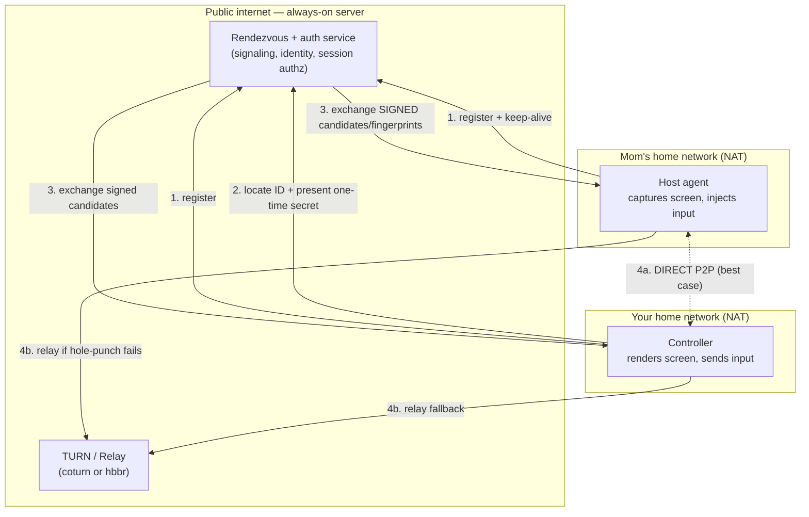

# Remote Desktop — Product Spec & Implementation Plan (v2)

Date: 2026-07-11
Owner: Dave Robertson

A self-hosted TeamViewer/AnyDesk replacement for screen sharing, file transfer, and remote control between computers. Built for personal + family/friend support, on infrastructure you control.

> [!NOTE]
> **v2 changelog.** This revision folds in a technical review. Biggest changes: (1) transport **encryption** and peer **authentication** are now treated as separate problems throughout — WebRTC gives you the first, not the second; (2) the short ID is redefined as a **locator, not an authenticator**; (3) consent is **capability-scoped**, not one Boolean; (4) Track B's build order now puts **threat model + authenticated signaling first**; (5) RustDesk, WebRTC systems, and AnyDesk are described as sharing a *pattern*, not an implementation; (6) claims about Oracle allocation, latency, "zero cost," and one-file family deployment are softened to match reality.

---

## 1. Vision & scope

**One line:** Sit at your machine, help Mom/Dad/Connor/Kevin fix theirs, by having them read you a short connection code — no port forwarding, no accounts, no paid tier, no session data leaving infrastructure you control.

**Who it's for (priority order):**

1. **You ↔ your own machines** (Dominic, Duncan, Walter). Already on one tailnet. Easiest case.
2. **You → a family member's machine** ("helper flow"). Non-technical, different home network. The hard case, and the one that dictates the whole design.
3. **You → a friend's machine** (Kevin in California). Same as #2 but cross-country, so relay fallback and latency matter more.

**Non-goals:**

- Not a device-fleet manager (that's MeshCentral — dashboards, patching, 100+ endpoints).
- Not a public SaaS for strangers (changes the entire security + bandwidth + abuse model).
- Not a low-latency gaming/creative stream (Parsec / Sunshine+Moonlight own that).

---

## 2. The three roles (they invert intuition)

| Role | Who | What their machine does |
|---|---|---|
| **Host / Target** | The family member being helped | Captures its screen, receives + injects input, serves files |
| **Controller / Viewer** | You | Renders their screen, sends input, requests files |
| **Rendezvous** | Your server | Introduces the two machines and authenticates the introduction |

The counterintuitive part: when you help Mom, *her* machine is the host — it shares its screen and is controlled. In family support, the least technical person runs the hardest-to-set-up software. That's why the host-side onboarding is the make-or-break UX problem.

---

## 3. Core features

### MVP

- **Zero-config connect via a short session ID.** Host launches, gets a short human-readable ID + a one-time secret. Controller enters the ID to *locate* the host; the one-time secret *authenticates* the request; the host *authorizes* by approving. (Do not conflate these three steps — see §5.2.)
- **Live screen view** (host → controller), one monitor, adaptive quality.
- **Remote control** (controller → host): mouse + keyboard injection.
- **Capability-scoped consent** (§5.4): the host approves *what* you can do, not just *whether* you connect. Visible "X is controlling your screen" banner + instant kill.

> [!IMPORTANT]
> Define the ID as a **short human-readable session locator**, not literally "9 digits." Nine digits is a RustDesk UX artifact. If you issue your own IDs (Track B), pick the format and length deliberately — and never let ID possession alone start screen viewing, file access, or login.

### Fast-follow

- **File transfer** both directions (half your stated use case) — with a real application-level protocol, not just a raw DataChannel (§5.7).
- **Clipboard sync**, off by default or explicitly visible.
- **Multi-monitor** selection.
- **Unattended access** to your *own* always-on machines — via device-key pairing, not a stored shared password (§5.5).

### Later

- Audio forwarding, session recording, chat sidebar, mobile viewer, Wake-on-LAN.

---

## 4. Architecture

Three components share a *pattern*; their internals differ.

> RustDesk, WebRTC-based remote-control systems, and commercial tools like AnyDesk share the broad **rendezvous → direct → relay** pattern. But their signaling, transport, codec, identity, and encryption implementations are all different. RustDesk's hbbs/hbbr stack is its own protocol; a WebRTC build uses ICE, STUN, TURN, DTLS, SRTP, and SCTP DataChannels. Don't think of RustDesk as "a WebRTC app" — it isn't.



**The flow, in words:**

1. Both machines ping the rendezvous server so it knows their current public IP:port. As long as a client is running, it constantly pings the ID server to keep its address known.
2. You supply the host's ID to *locate* it and the one-time secret to *authenticate* the request.
3. The server brokers the ICE candidates and DTLS fingerprints — and this exchange must be **authenticated**, or a malicious/compromised server can substitute a fingerprint and MITM the session (§5.1).
4. If hole-punching works (usually), traffic is direct P2P and the server never sees the stream. If it fails (symmetric NAT, CGNAT, strict firewalls), traffic falls back to the relay. In most cases hole-punching succeeds and the relay isn't used — but **plan operationally as if every important session might relay** (§8, Risks).

Only the rendezvous + relay must be public and always-on. Your homelab (Dominic included) is behind NAT, so it can't be that server as-is — see §6.

---

## 5. What to consider (the hard problems, ranked by pain)

### 5.1 Peer authentication vs. transport encryption — the correction that reframes everything

These are two different questions:

- **Encryption** — "can an outsider read or tamper with this connection?" WebRTC's mandatory DTLS-SRTP answers this for free.
- **Authentication** — "am I connected to Mom's *actual* computer, and not an attacker the signaling service introduced?" WebRTC does **not** answer this for you.

The SDP exchange carries DTLS fingerprints. A compromised or malicious signaling server can swap those fingerprints and sit in the middle, and the encryption won't notice — both legs are encrypted, just to the attacker. So you must authenticate the exchange. Pick at least one binding mechanism per use case:

| Mechanism | Best for |
|---|---|
| Server-authenticated account/device keys | Unattended access to your own machines |
| One-time pairing secret shown on both devices | Attended family support |
| QR code carrying a signed session invitation | Better family UX (no typing) |
| Persistent device public-key pinning | Known repeat devices |
| Short Authentication String, compared verbally | High-assurance first pairing |

Replace the v1 phrase "WebRTC gives you E2E encryption for free" with: **WebRTC provides encrypted peer transport; the application must authenticate peer identities and protect signaling against substitution.**

### 5.2 NAT traversal — still the hardest connectivity problem, and it *is* your zero-config feature

The short-ID experience is 90% this. Two home routers, no port forwarding, requires the full ICE stack:

- **STUN** — "what's my public IP:port?" Cheap, stateless.
- **TURN** — relays traffic when direct fails. The **expensive** part: it carries full session bandwidth. This is exactly what AnyDesk/TeamViewer meter — *they're* paying for your relay.
- **ICE** — gathers candidate paths (host, server-reflexive, relayed) and picks one that works.

> [!IMPORTANT]
> Don't hand-roll ICE. Use WebRTC (browser + Pion/libwebrtc/webrtc-rs), which bundles STUN/TURN/ICE + DTLS + adaptive media. Rolling your own NAT traversal is where hobby projects die.

### 5.3 The short ID is a locator, not an authenticator

Correct attended flow, in strict order:

1. **Short ID** → locate the host.
2. **One-time secret** → authenticate the request.
3. **Host approval** → authorize control.
4. **Ephemeral peer keys** → encrypt the session.

Possession of the ID alone must never initiate screen viewing, file browsing, clipboard access, or unattended login. Treat the ID like a phone number, not a password.

### 5.4 Consent is capability-scoped, not one Boolean

The host approves *capabilities* separately, with safe defaults:

| Capability | Default |
|---|---|
| View screen | Ask |
| Control mouse/keyboard | Ask |
| Read clipboard | Off until approved |
| Write clipboard | Ask, or session toggle |
| Receive files (host ← controller) | Ask per transfer |
| Send files (host → controller) | Ask per file/folder |
| Elevate privileges | Separate confirmation |
| Restart / reconnect | Separate confirmation |
| Install unattended access | **Never** bundled into an attended approval |

Plus **session revocation**: one-click host termination, credential invalidation after the session, expiring invitations, a max session duration, server-side replay prevention, device-key revocation, an audit log of *metadata only* (never screen/file contents), and an emergency "disable all unattended access" switch.

### 5.5 Unattended access: pair with keys, don't store a password

For always-on machines, prefer **asymmetric device-key pairing**; use a password only to unlock the *local* private key, not as the network credential. If you must have a password path, it needs: memory-hard derivation (Argon2id), per-device salt, challenge-response (never send the password), rate limiting, increasing backoff, device/IP lockout thresholds, and a recovery path via local console or recovery key.

### 5.6 Screen capture → encode → transport → decode → render

Every millisecond is felt.

- **Capture**: Windows Desktop Duplication API; macOS ScreenCaptureKit; Linux PipeWire (Wayland) or X11. Ship only changed regions.
- **Encode**: prefer **hardware** encoders (NVENC, QuickSync, VideoToolbox). AnyDesk's speed reputation is largely its custom DeskRT codec.
- **Transport**: WebRTC media + adaptive bitrate (degrades quality instead of freezing).
- **Decode + render**: hardware decode → GPU surface.

**Latency is an objective, not a guarantee.** State it as: *median input-to-photon under ~100 ms on a healthy LAN and under ~180 ms on a good regional WAN, measured with a defined test protocol.* Glass-to-glass depends on frame pacing, encoder, capture API, browser decode path, display refresh, relay geography, jitter, and bitrate adaptation — none of which you fully control.

### 5.7 Input injection is platform-gated (and coordinates aren't pixels)

**Coordinates:** never send raw pixel positions. Send a normalized event with enough metadata to survive DPI scaling, browser zoom, resolution changes, monitor switches, and letterboxing:

```
monitor_id, source_width, source_height,
viewport_width, viewport_height, scale_mode,
x_normalized, y_normalized,
button, event_type, modifier_state,
sequence_number, timestamp
```

**Per platform:**

- **Windows**: `SendInput`, but it's restricted by User Interface Privilege Isolation — it injects only into processes at equal-or-lower integrity, and can't touch the secure desktop (UAC, lock screen, Ctrl+Alt+Del) from a normal user context. "Run as a service in session 0" is *not*, by itself, a complete answer. You need a **service + per-user interactive agent** split:

  ```
  Windows service
    ├─ privileged lifecycle / update
    ├─ secure IPC
    └─ per-user interactive agent
         ├─ capture
         ├─ input
         └─ consent UI
  ```
  Design explicitly for: standard desktop, elevated apps, UAC secure desktop, lock screen, logon screen, fast user switching, and multiple interactive sessions. The service is not the renderer for every session.

- **macOS**: Screen Recording *and* Accessibility are separate grants in Privacy & Security, and some features also need Input Monitoring. Account for TCC permission persistence, relaunch-after-grant behavior, the screen-sharing privacy indicator, app-signing stability, and login-window limitations. A "three toggles" onboarding sheet won't stay exactly three toggles across macOS releases — make it **version-aware**.

- **Linux**: treat as *three distinct products* — X11 host, Wayland host, and headless/login-screen host. On Wayland, a PipeWire capture stream does **not** grant input control; portal-mediated capture (xdg-desktop-portal) and portal-mediated *control* must be designed and tested together.

### 5.8 Security posture, operational

- **Expect AV false positives.** Remote-control software is flagged as a PUP by Defender/ESET by default — the same category as any remote-access tool. You'll be allowlisting on family machines, or code-signing.
- **Relay is a soft-DoS/cost vector** even at family scale: a session left pinned all day on relay is your bandwidth bill.
- **The web viewer has real constraints.** It's excellent for view + input, but browser lifecycle, clipboard permissions, keyboard capture (some keys are reserved by the browser/OS), fullscreen behavior, file-system access, and mobile-Safari quirks all need explicit testing. It's a strong default, not an automatic win.

### 5.9 The "small stuff" users notice immediately

Clipboard sync, multi-monitor, keyboard-layout mapping across locales (an underrated nightmare), DPI/resolution scaling mismatch, and reconnect-on-blip. Individually easy; collectively the line between "works" and "feels cheap."

---

## 6. Deploying on YOUR infrastructure

The rendezvous + relay must be publicly reachable by both peers. Dominic is behind your eero NAT, so it can't serve that role as-is.

| Option | Cost | Trade-off |
|---|---|---|
| **Oracle Cloud Always Free** (Ampere A1) | Potentially free | Oracle documents non-expiring Always Free offers and an eligible A1.Flex shape, **but the exact core/RAM allowance and capacity depend on region and tenancy and can change** — don't bake "4-core/24 GB forever" into your definition of done. Verify at provision time. |
| **Cheap VPS** (Hetzner ~€4/mo) | ~$5/mo | Simplest and most predictable. |
| **Port-forward + DDNS on the eero → Dominic** | Free | Purest "own hardware," but you expose ports on your home network and pin your ID to a residential IP. Weakest security posture; only with hardening. |

**Recommended split:**

- **Your own machines** (Dominic ↔ Duncan ↔ Walter): you already run **Tailscale**. Just use VNC/RDP/SSH over the tailnet — no rendezvous server, no new code. Tailscale *is* your zero-config for machines you control. Solves role #1 today.
- **Family/friends** (roles #2/#3): they can't join your tailnet easily (not zero-config for Mom). The public rendezvous + short-ID flow earns its keep here. Put hbbs+hbbr (Track A) or your signaling+coturn (Track B) on the public box.

> [!WARNING]
> Don't route family support through your tailnet by installing Tailscale on their machines. It works, but it puts their device on your private network and isn't the "read me a code" experience. Keep the paths separate: **Tailscale for yours, ID-server for theirs.**

---

## 7. Track A — self-host RustDesk (utility this week)

### Correct port set (don't open the range blindly)

| Port | Proto | Purpose | Required? |
|---|---|---|---|
| 21115 | TCP | NAT-type test | Normally |
| 21116 | TCP | Hole-punch / connection service | Yes |
| 21116 | UDP | Registration + heartbeat | Yes |
| 21117 | TCP | Relay (hbbr) | Yes |
| 21118 | TCP | ID-server WebSocket | Only for web-client paths |
| 21119 | TCP | Relay WebSocket | Only for web-client paths |
| 21114 | TCP | Pro API / web console | Not for OSS |

Minimum functional set for native clients is **21115–21117 TCP + 21116 UDP**. 21118–21119 are WebSocket-only; 21114 is Pro.

### The family-deployment reality (graded, honestly)

The polished custom-client generator is a **Server Pro** feature. OSS options, best to worst for a non-technical host:

1. **Self-extracting bundle (recommended for Mom/Dad).** A 7-Zip SFX that drops the official standalone exe + a config, applies your ID server + public key, launches it, and cleans up. Best OSS balance — but it's an *engineered installer*, which softens the literal "one clean portable binary" claim.
2. **Filename-config hack (Windows only).** Rename the standalone exe to `rustdesk-host=MY.DOMAIN,key=MY-PUBLIC-KEY=.exe` and it reads config from its own name. Real, but fragile: it silently loses to a leftover config in `%appdata%\RustDesk` from a prior install, the filename looks like malware, and the command-line/filename trick is Windows-only — Android clients still require typing the key in.
3. **Manual config once per machine.** Reliable, but it's hands-on setup, not "run one file."
4. **Maintain your own client build** with server settings embedded — most control, most maintenance.
5. **Buy Server Pro** if clean packaged deployment is worth more than the effort.

> [!NOTE]
> Net: the "download one file, run it, read me the code" experience is achievable on OSS via option 1, but it's a packaging task you build — not something OSS hands you. Plan for it as work.

### Key handling

Grab `id_ed25519.pub` and point clients at it — **and also**: protect the private `id_ed25519`, back up the server's persistent data directory off-machine (encrypted), pin/distribute only the public key, verify every client shows the same fingerprint, and treat an accidental server-key regeneration as a **security event** (it silently breaks trust for every client).

### Operational work Track A must include

Persistent Docker volumes · off-machine encrypted backups · image version pinning · a tested upgrade/rollback path · log rotation · firewall verification · hbbs/hbbr uptime monitoring · relay-bandwidth monitoring · DNS-failure fallback · server-key recovery procedure · a vulnerability/update cadence.

---

## 8. Track B — build your own (the learning project)

### Recommended layout — keep auth separate from signaling

```
apps/
  controller-web/
  host-windows/
  admin-cli/
services/
  signaling/          # brokers messages — NOT the security model
  session-auth/       # identity + session authorization
  turn/
packages/
  protocol/  crypto/  file-transfer/  input-events/  telemetry/
```

A signaling service should never silently *become* the entire security model. Identity and session authorization live in their own service.

### PLAN: a Windows-first, authenticated remote-support system

**Definition of done:** From your laptop, connect to a fresh Windows machine on a *different* home network by having its user run one file and read you a short code — see their screen, control it, and push a file to their desktop — with the peer **authenticated** (not just encrypted), consent **capability-scoped**, the connection surviving a Wi-Fi blip **without silently bypassing approval**, and no mandatory software subscription.

**Build order (auth moved early — do not defer it):**

| Stage | Deliverable | Exit condition |
|---|---|---|
| **B0** | Threat model + protocol schema | Trust boundaries + attacker capabilities documented |
| **B1** | Authenticated signaling | Two clients register and exchange **signed** session messages |
| **B2** | Browser↔browser DataChannel | Direct *and* relayed text verified |
| **B3** | TURN deployment (coturn) | Forced-relay test passes |
| **B4** | Synthetic video track | Test-pattern (timestamp + frame counter + moving grid + color bars) renders with **measured** latency |
| **B5** | Windows screen capture | Desktop Duplication frames reach the browser |
| **B6** | View-only consent session | Host explicitly approves *viewing* before any frame is sent |
| **B7** | Input protocol + injection | Mouse/keyboard control works within integrity limits, using normalized coords (§5.7) |
| **B8** | File transfer | Chunking, hashes, cancellation, resume, path-traversal protection (§below) |
| **B9** | Pairing / unattended | Device keys, revocation, lockout validated |
| **B10** | Recovery / reconnect | Wi-Fi interruption resumes **without** bypassing approval |
| **B11** | Packaging / signing | Family-safe installer + update path exist |

**Why B4 (synthetic video) before B5 (real capture):** it isolates transport problems from OS-capture problems, and lets you measure capture-to-display latency, dropped frames, codec delay, bitrate adaptation, and TURN-vs-direct performance cleanly.

**File-transfer protocol (B8) must include:** metadata negotiation · transfer ID · fixed-size chunks · chunk sequence numbers · end-to-end hash · per-chunk or rolling verification · cancellation · backpressure · resume bitmap/range requests · destination confirmation · **path-traversal protection** · filename sanitization · max file size · **no automatic execution** of received files. RTCDataChannel is just the pipe; this is the protocol on top.

**Dependencies:** B2 depends on B1 (no auth'd discovery, no trustworthy connection). B3 must land *before* testing with real remote family, not after. B4–B8 depend on B2. Consent (B6) precedes control (B7) and files (B8) deliberately — retrofitting consent/identity onto a working insecure prototype is the trap that makes the assumptions hard to replace.

**Risks (with the early signal for each):**

- **Signaling substitution / MITM** — *signal:* you never actually verify the peer's key, only that "it connected." *Mitigation:* B0/B1 first; bind DTLS fingerprints to authenticated identities.
- **NAT traversal fails on a specific network** (symmetric/CGNAT) — *signal:* only works when you force relay. *Mitigation:* coturn is mandatory; budget relay as normal, not rare.
- **macOS/Windows permission + integrity walls** — *signal:* input does nothing until grants are given / can't drive UAC. *Mitigation:* version-aware onboarding; service + per-user agent split.
- **Over-scoping Track B** — *signal:* three weekends in and streaming still stutters. *Mitigation:* Track A already runs, so Track B stays a *learning* project, not a dependency. Scope one platform at a time.

**Confidence:** High for Track A reaching utility (hours). Medium for Track B reaching parity — the hard parts aren't screen sharing and NAT traversal; they're **peer authentication, privileged OS integration, safe unattended access, reliable reconnect, and packaging a non-technical host experience.**

---

## 9. Acceptance criteria (add to definition of done)

| Area | Acceptance test |
|---|---|
| Fresh Windows machine | User runs it with no manual server config |
| Direct path | Connection reports host/srflx candidate, not relay |
| Relay path | Forced TURN/hbbr session stays usable |
| Consent | No frame or input before approval |
| Session identity | Controller name/key shown to host |
| Revocation | Host termination stops all channels immediately |
| Reconnect | Network loss resumes without silently bypassing approval |
| File integrity | Received hash matches sender hash |
| Upgrade | Client update preserves config + device keys |
| Server failure | Behavior of an existing direct session is defined |
| Server-key loss | Recovery procedure tested |
| Brute force | Lockout/backoff verified |
| Clipboard | Off by default or explicitly visible |
| Audit | Connection metadata recorded; no screen/file contents |
| Latency | Measured, direct and relayed |
| Bandwidth | Measured at idle, 1080p office use, and motion-heavy use |

---

## 10. Bottom line

- **Track A:** Self-host RustDesk OSS for working remote support quickly — but treat preconfigured one-file family deployment as a **separate packaging task** (RustDesk's clean custom-client workflow is Server Pro). Use Tailscale + VNC for your own machines.
- **Track B:** Build a **Windows-first** remote-support system with **authenticated** signaling, WebRTC ICE/STUN/TURN transport, a native capture/input agent, a browser controller, **capability-scoped** consent, and **device-key pairing** for unattended access.
- **The thing to internalize:** the hardest parts are not screen sharing and NAT traversal. They are **peer authentication, privileged OS integration, safe unattended access, reliable reconnect, and packaging a host experience a non-technical person can run.** The commercial tools' real moat is the always-on authenticated relay + the polished host onboarding — reproduce those two and you've reproduced the product; everything else is comparatively easy.

**No mandatory software subscription** — but budget for a domain, possible VPS upgrades, backups, code signing (esp. Apple), and bandwidth overages. "Free" means no vendor license, not zero cost.
